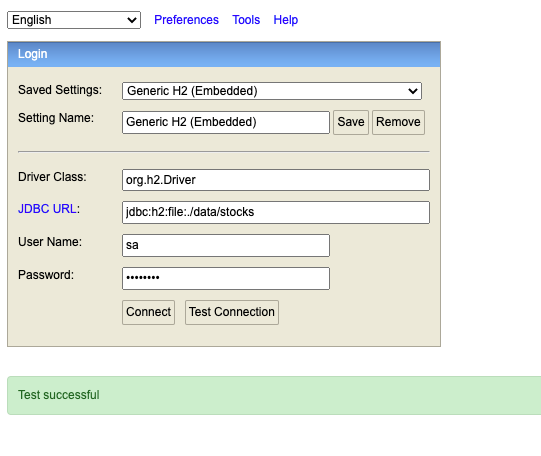
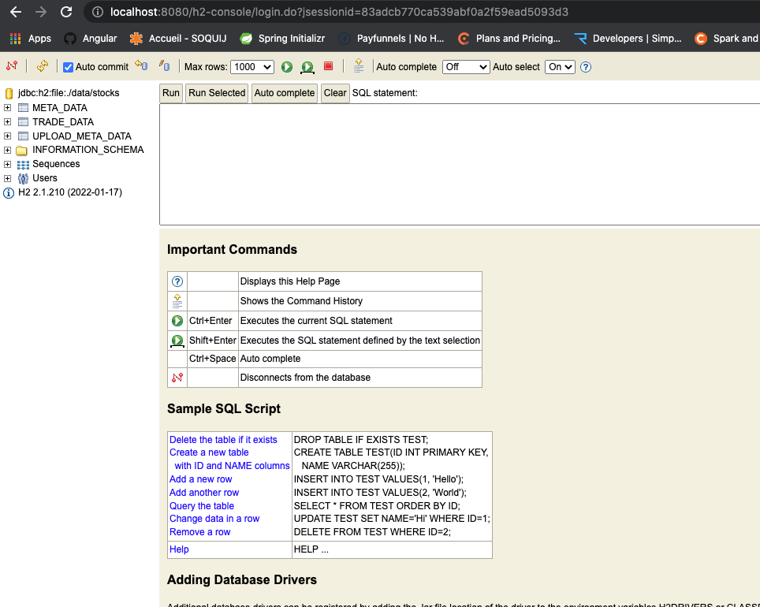

# RUNNING THE APPLICATION.

1. Either download or git clone the application.
2. `cd` into `src` and run `./gradlew clean build bootrun`, to build, test and run the application.
3. use the URL, `http://localhost:8080/swagger-ui/index.html`, to get hold of the documentation and to run the application.
4. you can access the DB from the URL, `http://localhost:8080/h2-console`.
    1. you will be presented with a screen like below
       
    2. please enter the data as shown and enter the password as, `password`, and hit the button, `Test Connection`.
    3. if successful re-enter the password and hit connect to see the screen below.
       
5. please email me for more information.    

### Reference Documentation
For further reference, please consider the following sections:

* [Official Gradle documentation](https://docs.gradle.org)
* [Spring Boot Gradle Plugin Reference Guide](https://docs.spring.io/spring-boot/docs/2.7.0-SNAPSHOT/gradle-plugin/reference/html/)
* [Create an OCI image](https://docs.spring.io/spring-boot/docs/2.7.0-SNAPSHOT/gradle-plugin/reference/html/#build-image)
* [Spring Batch](https://docs.spring.io/spring-boot/docs/2.6.2/reference/htmlsingle/#howto-batch-applications)
* [Spring Data JPA](https://docs.spring.io/spring-boot/docs/2.6.2/reference/htmlsingle/#boot-features-jpa-and-spring-data)
* [Spring Data JDBC](https://docs.spring.io/spring-data/jdbc/docs/current/reference/html/)
* [Spring Boot DevTools](https://docs.spring.io/spring-boot/docs/2.6.2/reference/htmlsingle/#using-boot-devtools)

### Guides
The following guides illustrate how to use some features concretely:

* [Creating a Batch Service](https://spring.io/guides/gs/batch-processing/)
* [Accessing Data with JPA](https://spring.io/guides/gs/accessing-data-jpa/)
* [Using Spring Data JDBC](https://github.com/spring-projects/spring-data-examples/tree/master/jdbc/basics)

### Additional Links
These additional references should also help you:

* [Gradle Build Scans – insights for your project's build](https://scans.gradle.com#gradle)

